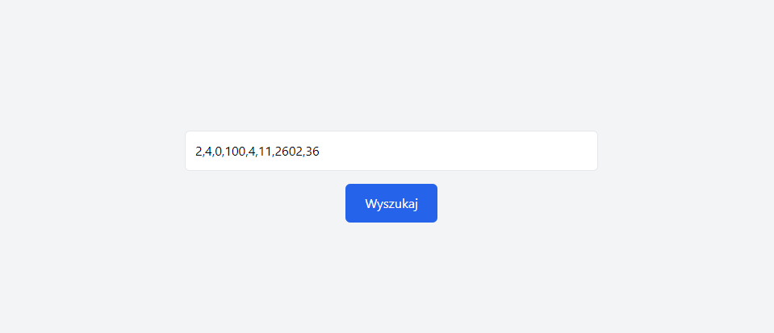

# Odd Value Finder

Aplikacja **Odd Value Finder** jest prostą aplikacją do wyszukiwania wartości odstającej w tablicy liczb całkowitych. Została stworzona przy użyciu frameworka **Vue.js** i narzędzia **Vite** z wykorzystaniem **Tailwind CSS** do stylizacji. 

## Opis

Aplikacja umożliwia użytkownikowi wprowadzenie tablicy liczb całkowitych oddzielonych przecinkami. Po kliknięciu przycisku "Wyszukaj", aplikacja analizuje tablicę i wyświetla jedyną liczbę, która jest różna od pozostałych (czyli jedyną nieparzystą wśród parzystych lub odwrotnie). Użytkownik może również wrócić do ekranu wejściowego, aby wprowadzić nową tablicę liczb.

## Funkcjonalności

- **Input Screen**: Umożliwia użytkownikowi wprowadzenie liczby całkowitych oddzielonych przecinkami i wyszukiwanie wartości odstającej.
- **Result Screen**: Wyświetla wynik oraz umożliwia powrót do ekranu wejściowego.

## Technologie

- **Vue.js**: Framework do budowy interaktywnych interfejsów użytkownika.
- **Vite**: Narzędzie do szybkiego budowania aplikacji.
- **Tailwind CSS**: Utility-first framework CSS do stylizacji aplikacji.

## Zrzuty ekranu

